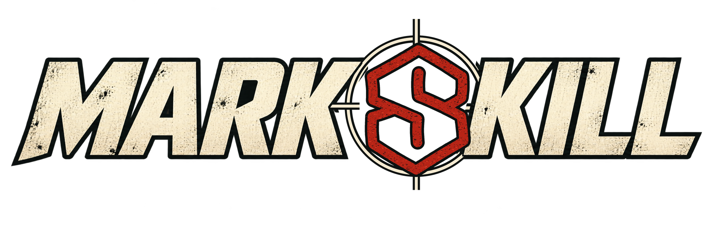

# markskill

<p align="center"></p>

markskill helps agents decide what to change in code and product design. It keeps what works and ties each result to the checks that actually ran.

The [framework overview](https://thedevmark.github.io/markskill/) summarizes its scope and components.

It runs on any agent that loads the Agent Skills convention (`SKILL.md` plus reference files): Claude Code, Codex, ZCode, and others. The skill is plain markdown, so it also works as a standalone review checklist for a human.

## What it does

- **Code:** Trace the behavior to its owner and fix it without weakening safeguards or adding unnecessary complexity.
- **Design:** Work from real content and the existing product to improve hierarchy, copy, and interaction.
- **Review:** Prioritize concrete problems, make scoped changes, and report what was actually verified.

## Scope check

The claim is "everything the agent builds and ships." Check it against the files instead of trusting this README:

| claim | enforced by |
|---|---|
| No fluff in copy | `references/writing-and-copy.md` — semantic redundancy pass, pattern clusters, weak vocabulary |
| Nothing invented | SKILL.md priorities — fabricated claims, invented metrics, testimonials, and outcomes are P0 failures |
| Looks good, not decorated | `references/visual-and-interaction.md` — tell catalog, emphasis rules, squint test |
| Fits your product, not a template | `references/design-restraint.md` — grounding in real content and tokens, one committed direction |
| Survives real use | `references/design-restraint.md` — keyboard, focus, states, zoom, reduced motion |
| Honest about what was verified | `references/evidence-and-testing.md` — labeled evidence; never claim a render or test that did not happen |
| Iterates without thrashing | `SKILL.md` fast iteration mode, decision ledger, feedback handling in `references/promotional-assets-and-feedback.md` |
| Protects accumulated context | direct execution for context-heavy or tightly coordinated work; evidence-backed delegation only for bounded, independent tasks |
| Builds only what earns its keep | `references/code-restraint.md` — comprehension-first ownership, implementation ladder, dependency gate, safety floor, regression evidence |

The boundary, stated plainly: this governs implementation restraint, product surfaces, and verification honesty. It is not a substitute for dedicated correctness, security, performance, or architecture review; it keeps those guards from being traded away in the name of minimalism.

## Install

Clone straight into your agent's skills directory:

```bash
# Claude Code
git clone https://github.com/thedevmark/markskill.git ~/.claude/skills/markskill

# Codex
git clone https://github.com/thedevmark/markskill.git ~/.codex/skills/markskill

# ZCode
git clone https://github.com/thedevmark/markskill.git ~/.zcode/skills/markskill
```

On Windows the same commands work in Git Bash; in PowerShell replace `~/` with your home directory. To share one copy across agents, clone once and symlink the others into it. For a single project only, clone into `.claude/skills/` (or your agent's project-level equivalent) inside the repo.

No skill infrastructure? Open `SKILL.md`, read it, and apply it. That is the whole mechanism.

## Use

Ask your agent, in plain language:

- "Use markskill to critique the pricing page."
- "Revise the empty states on the dashboard. Distill, don't redesign."
- "Audit this store screenshot set for slop before I ship it."
- "Simplify this diff without moving the behavior or deleting its guards."
- "Fast iteration: make this one change, check the affected behavior, and report."

The skill also applies to over-engineering, YAGNI, dependency choice, refactoring, polish, hierarchy, taste, density, clarify, distill, harden, quieter, or bolder. A critique names the few highest-value findings and exact corrections. A revision reports what changed, what was preserved, and what was actually verified.

## Files

| file | job |
|---|---|
| `SKILL.md` | Shared rules, path routing, fast iteration, and reporting |
| `references/design-restraint.md` | Design modes and workflow for product surfaces |
| `references/writing-and-copy.md` | Copy rules, pattern-cluster table, editing tests, example corrections |
| `references/visual-and-interaction.md` | Visual tell catalog and verification matrix |
| `references/evidence-and-testing.md` | Evidence labeling and audit method |
| `references/promotional-assets-and-feedback.md` | Store art, thumbnails, social graphics, iterative feedback handling |
| `references/code-restraint.md` | Implementation ladder, root-cause ownership, dependency restraint, safety floor, and code-review method |
| `agents/openai.yaml` | Interface metadata for OpenAI-compatible agent hosts |

## Where this fits: context engineering

This framework is one public piece of a context-engineering system I am building across my repositories. The premise: you get better agent work by engineering what the agent sees than by writing a cleverer prompt. Each repo carries its own operating context — an `AGENTS.md` that is the single authority, thin tool adapters instead of duplicated instructions, a routing index that loads only task-relevant files on demand, guarded versioned memory for durable facts, compaction and sub-agent isolation conventions, and an executable test that fails when the context layer itself drifts. The repos prompt themselves; the agent arrives routed.

This repo is the shareable surface of that system: the skill that keeps the output honest while the context layer keeps the input honest. The private side is in active development and in daily use.

## License

MIT
