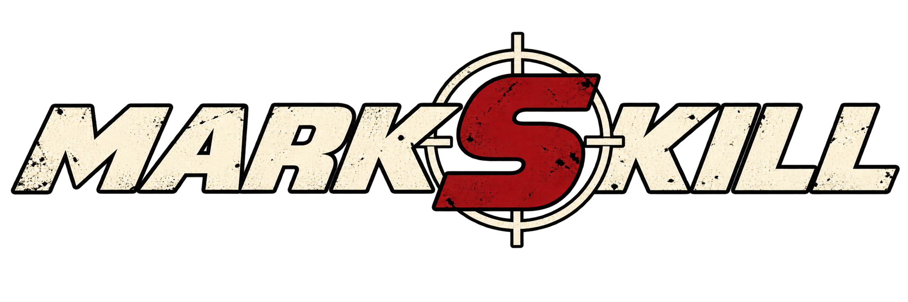

# markskill

<p align="center"></p>

**Understand the whole problem. Change what the evidence demands.**

markskill is a judgment framework for AI agents and assistants working on code and product surfaces. It helps an agent decide whether the warranted change is a local repair, a shared-owner correction, a structural refactor, a staged migration, or a replacement. It looks for the complete solution with no complexity it does not need, and it refuses invented proof and claims the evidence does not support.

The [framework overview](https://thedevmark.github.io/markskill/) summarizes its scope and components.

Any AI agent or assistant that can read Markdown instructions can use it. Hosts that support the Agent Skills convention load `SKILL.md` and its references directly; elsewhere, provide those files as context. It is plain Markdown with no scripts, hooks, or setup commands, and it also works as a review guide for a human.

## Start from the record

Agents re-derive the same facts every session: where the tokens live, who owns an invariant, what the product's voice sounds like, which decisions the owner already made. markskill reads the repository's project record first (`AGENTS.md`, `PRODUCT.md`, `DESIGN.md`, `docs/context/INDEX.md`) and writes back the durable facts a task establishes, one fact per versioned entry, so the next session starts from evidence instead of a search. It reuses whatever record the repository already has and creates only the smallest missing piece.

## Product surfaces

markskill begins with the user's full task and the real states the interface must support. It preserves the product's visual language and canonical components when they remain fit, removes repetition and decorative hierarchy, and keeps responsive behavior, accessibility, recovery, and honest states intact. When the composition or interaction model prevents the required outcome, it supports redesign or rebuilding instead of polishing the wrong structure.

## Code

markskill traces behavior through its invariants, callers, data lifecycle, and operational constraints before choosing scope. It repairs a sound owner and restructures, migrates, or replaces an unfit one. It does not trade away validation, authorization, recovery, observability, compatibility, or meaningful regression evidence to make a diff look smaller.

Work that crosses both sides uses one coherent change and a verification plan that fits the change.

## Scope check

The claim is "everything the agent builds and ships." Check it against the files instead of trusting this README:

| claim | enforced by |
|---|---|
| Remembers what it learned | `references/project-record.md` — read first, write on learn, one fact per entry, index points to the owning file |
| Chooses warranted scope | `references/code-restraint.md` — ownership tracing, intervention choices, migration and replacement tests, dependency gate, safety floor |
| Diagnoses before fixing | `references/code-restraint.md` — full error and stack, recent changes, layer-boundary logging, one hypothesis at a time |
| Proves tests prove something | `references/code-restraint.md` — regression proof by reversion, mutation thinking, condition-based waiting, pristine output |
| No fluff in copy | `references/writing-and-copy.md` — voice found in authored material, semantic redundancy pass, pattern clusters, weak vocabulary |
| Nothing invented | `SKILL.md` unconditional rules; `references/writing-and-copy.md` truth test; `references/design-restraint.md` labeled illustrative content with a replacement list |
| Names the excuse before acting on it | `references/review-and-report.md` — rationalization table, P0 to P3 severity, report shapes |
| Looks good, not decorated | `references/visual-and-interaction.md` — tell catalog, color strategy, typography floors, motion timing, native platform conformance |
| Fits your product, not a template | `references/design-restraint.md` — grounding in real content and tokens, a four-block direction contract |
| Survives real use | `references/design-restraint.md` and `references/visual-and-interaction.md` — keyboard, focus, states, zoom, reduced motion with an intentional alternative, input detection |
| Claims only what ran | `SKILL.md` unconditional rules; `references/review-and-report.md` claim gate; `references/evidence-and-testing.md` claim table, hedge-word check, runtime and data claims |
| Iterates without thrashing | `SKILL.md` fast iteration mode; feedback handling in `references/promotional-assets-and-feedback.md` |
| Delegates without losing context | `references/execution-and-review.md` — five-part delegation, four-status return, reviewer scope rules, scoped re-verification |

The skill guides scope, implementation judgment, product surfaces, and verification honesty. It does not replace dedicated review; the last line of `SKILL.md` says which kinds. Its effectiveness must be established per task family and harness rather than assumed from its wording.

## Evaluation status

The framework is **not presented as universally validated**. A completed four-task Astra calibration compared a neutral baseline, the previous Restraint wording, and a frozen earlier candidate on bounded and structural front-end and back-end work. All three arms passed every fixed private behavioral check. That is evidence against the fear that this approach always under-scopes; it is not evidence that the skill beats a neutral agent or should decide everything. A second calibration on 2026-09-29 ran the published bundle, frozen as `evaluations/arms/markskill-2026-09-29`, against a neutral control on the same four tasks under a Claude harness. Both arms passed every public and hidden check and chose the same scope class on every task; markskill used 17% more tokens. A third calibration the same day tested copy revision, a pre-ship critique, an unjustified redesign request, and honest reporting when the suite could not run; blinded judges scored the arms 53 to 53 and both passed every objective check. On a frontier model, markskill matched a neutral agent and added record-keeping, browser verification, and tiered findings rather than a better result; it is not evidence that it beats a neutral agent. See the [2026-09-21 results](evaluations/calibration/results-2026-09-21.md), the [2026-09-29 code results](evaluations/calibration/results-2026-09-29.md), the [2026-09-29 surface results](evaluations/calibration/results-2026-09-29-surfaces.md), and the [paired, blinded holdout protocol](evaluations/protocol.md).

## Install

With Node.js installed, run this in your terminal and choose the agents you use:

```bash
npx skills add thedevmark/markskill -g
```

This installs markskill for use across projects. Leave off `-g` to install it only in the current project. The installer supports Codex, Claude Code, and other agent hosts; select the targets it offers. Run `npx skills update markskill` later to fetch updates.

Prefer a manual install? Copy `SKILL.md`, `references/`, and `agents/` into a `markskill` folder in your agent's skills directory, such as `~/.codex/skills/markskill` or `~/.claude/skills/markskill`. Copy only those: `evaluations/arms/` holds frozen test versions with their own `SKILL.md` files, which a loader that scans subfolders would pick up as extra skills. If your agent has no skill loader, give it `SKILL.md` and the relevant reference files as context.

Using more than one agent? Keep one copy, for example in `~/.agents/skills/markskill`, and link each agent's skills folder to it: `ln -s ~/.agents/skills/markskill ~/.claude/skills/markskill` on macOS and Linux, or `mklink /J %USERPROFILE%\.claude\skills\markskill %USERPROFILE%\.agents\skills\markskill` on Windows. Every agent then reads the same files, and an edit never has to be copied. `agents/openai.yaml` only adds display metadata for Codex; other hosts ignore it.

## Use

Ask your agent, in plain language:

- "Use markskill to critique the pricing page."
- "Revise the empty states on the dashboard. Distill, don't redesign."
- "Audit this store screenshot set for slop before I ship it."
- "Simplify this diff without moving the behavior or deleting its guards."
- "Fast iteration: make this one change, check the affected behavior, and report."
- "Set up the project record for this repo from what is already here."

It also covers dependency choice, refactoring, migration, delegation, and the six refinement intents: clarify, distill, harden, polish, bolder, quieter. A critique names the few highest-value findings with a severity tier and exact corrections. A revision reports what changed, what was preserved or replaced, and what was actually verified.

## Files

| file | job |
|---|---|
| `SKILL.md` | Unconditional rules, shared rules, routing to the references, and fast iteration; kept short because it loads on every task |
| `references/review-and-report.md` | Claim gate, severity tiers, report shapes, delegation rule, and the rationalization table |
| `references/project-record.md` | What the project record holds, read-first and write-on-learn rules, and templates |
| `references/code-restraint.md` | Scope diagnosis, root-cause ownership, intervention choices, migration and replacement tests, safety floor, verification in proportion, and code-review method |
| `references/design-restraint.md` | Operating modes, surface modes, refinement intents, direction contract, and workflow for product surfaces |
| `references/writing-and-copy.md` | Voice grounding, copy rules by component, pattern-cluster table, editing tests, example corrections |
| `references/visual-and-interaction.md` | Tell catalog, hierarchy and spacing rules, typography floors, color strategy, motion timing, input and viewport adaptation, native conformance, verification matrix |
| `references/evidence-and-testing.md` | Evidence lanes and labels, runtime and data claims, claim table, state matrix, stabilization, and reporting |
| `references/promotional-assets-and-feedback.md` | Store art, thumbnails, social graphics, iterative feedback handling |
| `references/execution-and-review.md` | Briefs, progress records, delegation and return contracts, independent review, and templates for long or risky work |
| `evaluations/protocol.md` | Frozen comparison design, task matrix, scoring, critical failures, and claim boundaries |
| `evaluations/task-template.md` | Task-package contract for reproducible calibration and holdout cases |
| `evaluations/arms/` | Frozen comparison bundles and arm provenance |
| `evaluations/validate_manifest.py` | Preflight check for arm inventory, hashes, isolation declarations, and study completeness |
| `evaluations/calibration/results-2026-09-21.md` | One-shot Astra calibration outcomes, costs, and claim boundary |
| `evaluations/calibration/results-2026-09-29.md` | Calibration of the published bundle against neutral under a Claude harness |
| `evaluations/calibration/results-2026-09-29-surfaces.md` | Calibration on copy, critique, fit, and honest reporting, with blinded judgments |
| `evaluations/run_arm.sh` | Isolated local runner used for neutral and frozen skill arms |
| `research/engineering-judgment.md` | External benchmark and senior-practitioner evidence that shaped the rewrite |
| `agents/openai.yaml` | Interface metadata for OpenAI-compatible agent hosts |

## Lineage

markskill grew out of two open skill sets and deliberately stands alone from both. From [superpowers](https://github.com/obra/superpowers) (MIT) it adapts the process discipline: evidence before claims, delegation and review contracts, regression proof by reversion, and naming the excuse at the moment it appears. From [impeccable](https://github.com/pbakaus/impeccable) (Apache 2.0) it adapts the craft floor: direction contracts, color strategy, typography and motion numbers, native platform conformance, and durable project records. Everything here is rewritten to fit an evidence-led, proportionate framework; nothing is copied verbatim. The parts of both that mandate ceremony on small tasks, numeric scores, fixed loop counts, tooling, or redesign by default were left out on purpose.

---

## deutschmark's other apps

<table>
<tr><td align="center" width="56"></td><td><a href="https://yourpathos.app"><b>Pathos</b></a><br>Worker-side job search with source-linked roles, evidence-checked resumes, and application tracking.</td></tr>
<tr><td align="center" width="56"></td><td><a href="https://github.com/thedevmark/alert-alert"><b>Alert! Alert!</b></a><br>Turn a video URL or local file into a cropped, trimmed stream alert.</td></tr>
<tr><td align="center" width="56"></td><td><a href="https://github.com/thedevmark/auto-iphone-uploader"><b>Auto iPhone Uploader</b></a><br>Write a video's title and captions once on your PC, then post it from the real apps on your iPhone. Early preview.</td></tr>
<tr><td align="center" width="56"></td><td><a href="https://streamer.deutschmark.online"><b>Streamer Online</b></a><br>Build OBS scenes and browser-source overlays with connected streamer tools.</td></tr>
<tr><td align="center" width="56"></td><td><a href="https://github.com/thedevmark/forgetmenot"><b>ForgetMeNot</b></a><br>A local-first Twitch bot that remembers regulars, callbacks, and stream lore.</td></tr>
</table>

<sub>All projects → <a href="https://github.com/thedevmark">github.com/thedevmark</a></sub>

## License

MIT
